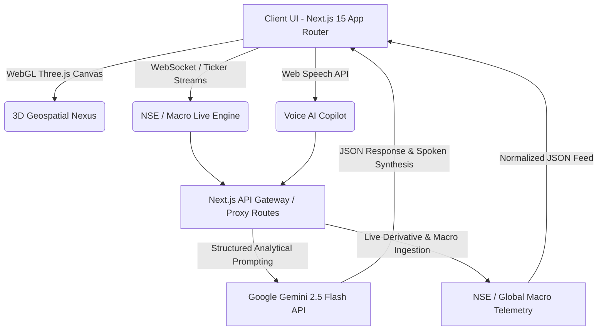

# <div align="center">🌐 FINSCOPE 360™ — Institutional Macro & Geopolitical Intelligence Terminal</div>

<div align="center">

[](https://nextjs.org/)
[](https://react.dev/)
[](https://threejs.org/)
[](https://ai.google.dev/)
[](https://www.typescriptlang.org/)
[](https://tailwindcss.com/)
[](LICENSE)

**An enterprise-grade, real-time macroeconomic terminal and geospatial energy nexus tailored for Indian capital markets, institutional desks, and geopolitical risk analysis.**

[Live Production Demo]([https://finscope-360.onrender.com](https://finscope-360-v-0-02.onrender.com/ai-intel)) • [Architecture Breakdown](#-system-architecture) • [Core Capabilities](#-core-capabilities) • [Local Deployment](#-local-deployment)

</div>

---

## 🏛️ Executive Summary

**FinScope 360** bridges the critical information gap between global maritime supply chain disruptions, cross-border macroeconomic capital movements, and Indian financial equity/derivative pricing. Built on a zero-latency WebGL geospatial engine paired with the **Google Gemini 2.5 Flash** reasoning framework, the platform delivers quantitative macro risk assessments, live NSE/BSE institutional liquidity metrics, and dynamic portfolio stress-testing in Indian Rupee ($\text{INR } ₹$) terms.

---

## ⚡ Key Capabilities & Modules

### 1. 🌍 3D Geospatial Energy Nexus & Trade Flow Matrix
* **Maritime Corridors & Port Analytics:** Real-time visual tracking of key domestic ports (**JNPT Mumbai, Mundra APSEZ, Paradip, Chennai**) alongside global supply nodes (**Ras Tanura 🇸🇦, Basra 🇮🇶, Novorossiysk 🇷🇺, Singapore 🇸🇬, Kaohsiung 🇹🇼**).
* **Strategic Energy Infrastructures:** Dynamic vector overlays of critical crude/gas pipelines including **Salaya-Mathura-Panipat (SMPL)** and **Paradip-Haldia-Barauni (PHBPL)**.
* **₹ Lakh Crore Linkage Breakdown:** Direct capital linkage profiling detailing annual throughput, live vessel anchorage count, and container freight impact.

### 2. 📊 High-Frequency Market Terminal (`/terminal`)
* **Indian Financial Asset Watchlist:** Real-time continuous price ticker for **NIFTY 50, BANK NIFTY, SENSEX, MCX Gold 24K, MCX Silver, Brent Crude (INR/bbl)**, and **USD/INR**.
* **Interactive Candlestick Visualizer:** Integrated high-performance OHLC charts powered by `lightweight-charts` with dynamic rupee price localization.

### 3. 🔥 NSE Sectoral Heatmap & Market Breadth (`/sectors`)
* **Real-time Sector Momentum:** Market-cap weighted visual performance across Nifty IT, Bank, Auto, FMCG, Metal, Pharma, Energy, and Infrastructure.
* **Live Advance/Decline Ratio:** Real-time market breadth gauge indicating institutional participation and index resilience.

### 4. 🏦 Institutional Liquidity & Option Derivative Matrix (`/institutional`)
* **FII & DII Cash & F&O Breakdown:** Daily cash equities, index futures, and stock long/short buildup tracking.
* **Live Nifty Put-Call Ratio (PCR) & Max Pain Engine:** Real-time sentiment gauge calculating underlying support bases and expiry settlement anchors.

### 5. 🤖 AI Macro Portfolio Stress-Tester (`/stress-test`)
* **Multi-Scenario Shock Modeling:** Evaluates retail and HNI stock/mutual fund portfolios against macro shocks (e.g., *Crude oil spikes to $95/bbl*, *Emergency RBI rate hikes*, *Red Sea maritime chokepoint closures*).
* **Hedge Optimization:** Gemini-powered risk mitigation recommendations with sector-specific drawdown estimates.

### 6. 🎙️ Voice-Controlled AI Financial Copilot
* **Multilingual Web Speech Integration:** Native voice command recognition supporting Hindi, English, and Hinglish for hands-free terminal execution and macro queries.

---

## 🏗️ System Architecture



---

## 🛠️ Technology Stack

| Domain | Technology / Framework |
| --- | --- |
| **Frontend Core** | Next.js 15 (App Router, Turbopack), React 19, TypeScript |
| **Geospatial & 3D** | Three.js, React-Globe.gl, WebGL Shaders |
| **Styling & UI** | Tailwind CSS, Lucide Icons, Custom Modern Cyber-Fintech Tokens |
| **Financial Charting** | TradingView Lightweight Charts |
| **AI & LLM Pipeline** | Google GenAI SDK (`gemini-2.5-flash`), System JSON Output Schema |
| **Voice Processing** | Web Speech API (SpeechRecognition + SpeechSynthesis) |
| **Deployment** | Render / Vercel (Edge-optimized production runtime) |

---

## 🚀 Local Deployment & Setup

### Prerequisites

* **Node.js**: `v18.17.0` or higher
* **Package Manager**: `npm` / `yarn` / `pnpm`


### 1. Clone the Repository

```bash
git clone [https://github.com/YOUR_USERNAME/finscope-360-terminal.git](https://github.com/YOUR_USERNAME/finscope-360-terminal.git)
cd finscope-360-terminal

```

### 2. Install Dependencies

```bash
npm install

```

### 3. Configure Environment Variables

Create a `.env.local` file in the project root:

```env
GEMINI_API_KEY=your_google_gemini_api_key_here

```

### 4. Run Development Server

```bash
npm run dev

```

Open [http://localhost:3000](http://localhost:3000) in your browser.

### 5. Production Build

```bash
npm run build
npm start

```

---

## 🔒 Security & Data Integrity

* **Strict Authentication Gate:** Client session persistence with role-based routing protecting terminal assets.
* **API Rate Limiting & Failover:** Resilient fallback simulation routines protecting institutional macro routes from external feed throttling.

---

## 👨‍💻 Author & Financial Technology Consulting

**Developed for Quantitative Financial Strategists, Macro Economists & Indian Capital Market Participants.**

* **License:** MIT License — free for academic and institutional research use.
